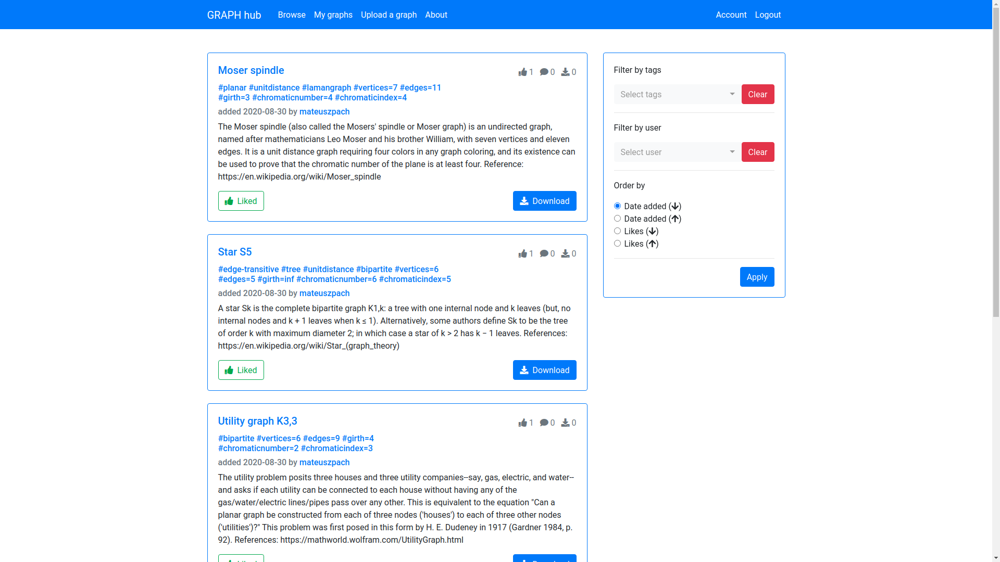

# GRAPH-hub
## About
GRAPH-hub allows you to browse variety of GRAPH-moment projects created by other users. 
After registration you can upload your own projects and share them with others. 
Users can comment and like projects as well as search them by tags or authors.

<kbd>
    
</kbd>

### Features
- Download any project you like.
- Upload your own projects.
- Comment projects.
- Like projects.
- Filter search by tags.
- Filter search by authors.
- Customize your profile picture.

### Frameworks used
- SQLAlchemy
- Flask
- Bootstrap

## Website
Website is hosted [here](http://40.113.65.249/).
